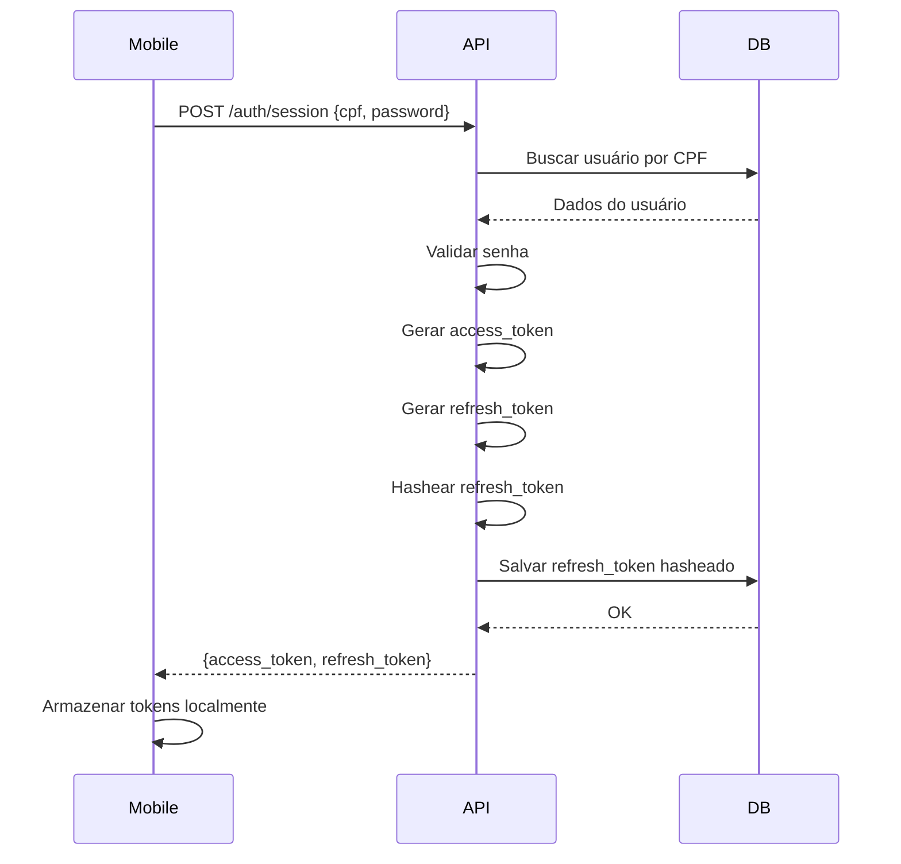
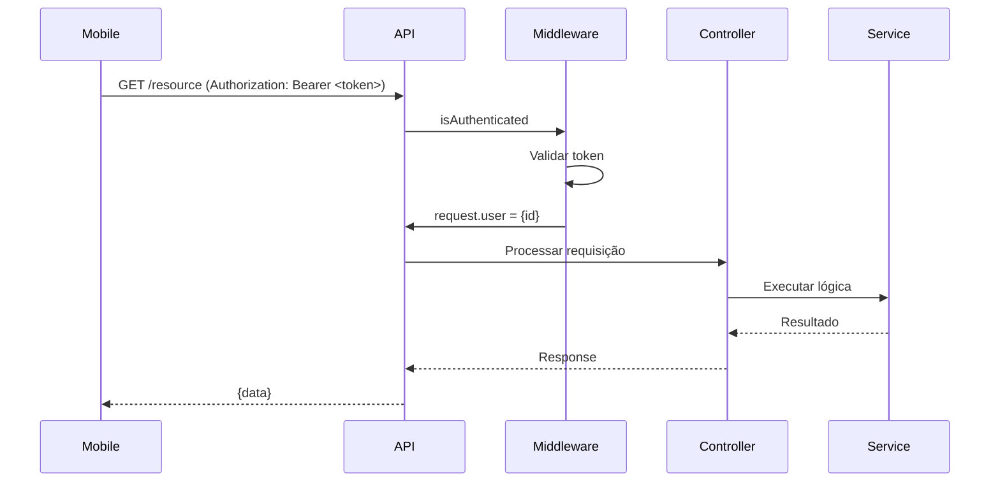
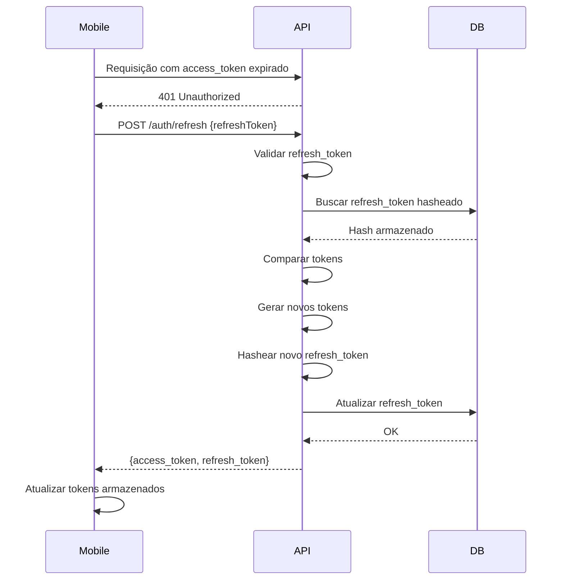

# 🔐 Changelog - Sistema de Autenticação JWT

**Data:** Janeiro 2026  
**Versão:** 2.0.0  
**Tipo:** Feature Major

## 📋 Resumo

Implementação completa de sistema de autenticação JWT via JSON (não HTTP-only cookies) para suporte a aplicativos mobile.

---

## ✨ Novas Funcionalidades

### 1. Módulo de Autenticação Completo

Criado módulo `authentication` com arquitetura completa:

```
src/modules/authentication/
├── domain/
│   ├── models/                    # 6 interfaces
│   └── repositories/              # 1 interface de repositório
├── services/                      # 4 services
├── infra/
│   ├── http/
│   │   ├── controllers/           # 4 controllers
│   │   └── routes/                # 1 arquivo de rotas
│   └── repositories/              # 1 implementação de repositório
```

### 2. Endpoints de Autenticação

#### POST /api/v1/auth/session
Login de usuários retornando tokens via JSON.

**Request:**
```json
{
  "cpf": "12345678900",
  "password": "senha123",
  "iosDeviceToken": "optional_token",
  "androidDeviceToken": "optional_token"
}
```

**Response:**
```json
{
  "access_token": "eyJhbGciOiJIUzI1NiIsInR5cCI6IkpXVCJ9...",
  "refresh_token": "eyJhbGciOiJIUzI1NiIsInR5cCI6IkpXVCJ9..."
}
```

#### POST /api/v1/auth/refresh
Renovação de tokens usando refresh token.

**Request:**
```json
{
  "refreshToken": "eyJhbGciOiJIUzI1NiIsInR5cCI6IkpXVCJ9..."
}
```

**Response:**
```json
{
  "access_token": "new_access_token",
  "refresh_token": "new_refresh_token"
}
```

#### GET /api/v1/auth/me
Buscar dados do usuário autenticado (requer autenticação).

**Headers:**
```
Authorization: Bearer <access_token>
```

**Response:**
```json
{
  "codigo": 1,
  "nome": "João Silva",
  "cpf": "123.456.789-00",
  "email": "joao@example.com",
  "cargo": "Enfermeiro",
  "status": "Ativo"
}
```

#### PUT /api/v1/auth/device
Atualizar device tokens (requer autenticação).

**Headers:**
```
Authorization: Bearer <access_token>
```

**Request:**
```json
{
  "iosDeviceToken": "new_ios_token",
  "androidDeviceToken": "new_android_token"
}
```

### 3. Middleware de Autenticação

**Arquivo:** `src/shared/middlewares/isAuthenticated.ts`

Funcionalidades:
- Valida Bearer token no header Authorization
- Verifica assinatura e expiração do token
- Injeta dados do usuário em `request.user`
- Retorna erro 401 padronizado se inválido
- Logging de falhas de autenticação

### 4. Services de Autenticação

#### AuthenticateService
- Valida CPF e senha
- Verifica status do usuário
- Gera access token e refresh token
- Hasheia refresh token antes de salvar
- Salva device tokens opcionais

#### UpdateAccessTokenService
- Valida refresh token
- Compara com hash armazenado
- Gera novos tokens
- Atualiza refresh token no banco

#### FindUserByTokenService
- Busca usuário pelo ID do token
- Remove dados sensíveis da resposta

#### UpdateDeviceTokenService
- Atualiza tokens de dispositivos iOS/Android
- Retorna dados do usuário atualizado

### 5. Repositório de Autenticação

**Arquivo:** `src/modules/authentication/infra/repositories/AuthenticationRepository.ts`

Métodos:
- `findUserByCPF(cpf)` - Busca usuário por CPF
- `findUserById(id)` - Busca usuário por ID
- `saveSession(user)` - Salva sessão com refresh token
- `updateRefreshToken(user)` - Atualiza refresh token
- `updateDeviceToken(user)` - Atualiza device tokens

### 6. Erros Personalizados

Criados 5 erros específicos de autenticação:

```typescript
// src/shared/errors/
- InvalidCredentialsError      // 401 - CPF ou senha incorretos
- UserNotFoundError            // 404 - Usuário não encontrado
- UserNotPermissionError       // 403 - Sem permissão de acesso
- UserNotLoginError            // 403 - Sem permissão de login
- RefreshTokenInvalidError     // 401 - Refresh token inválido
```

---

## 🔧 Alterações Técnicas

### Configuração de Autenticação

**Arquivo:** `src/shared/config/auth.ts`

**Antes:**
```typescript
export const authConfig = {
  jwt: {
    secret: env.JWT_SECRET,
    accessTokenLife: env.ACCESS_TOKEN_LIFE,
    refreshTokenSecret: env.REFRESH_TOKEN_SECRET,
    refreshTokenLife: env.REFRESH_TOKEN_LIFE,
    refreshTokenNotBefore: env.REFRESH_TOKEN_NOT_BEFORE,
  },
  cookies: {  // ❌ REMOVIDO
    httpOnly: true,
    secure: env.NODE_ENV === 'production',
    sameSite: 'strict' as const,
  },
}
```

**Depois:**
```typescript
export const authConfig = {
  jwt: {
    secret: env.JWT_SECRET,
    expiresIn: env.ACCESS_TOKEN_LIFE,
  },
  refreshToken: {
    secret: env.REFRESH_TOKEN_SECRET,
    expiresIn: env.REFRESH_TOKEN_LIFE,
    notBefore: env.REFRESH_TOKEN_NOT_BEFORE,
  },
}
```

### Tipos do Express

**Arquivo:** `src/@types/express/index.d.ts`

```typescript
declare namespace Express {
  export interface Request {
    user?: {
      id: string
    }
  }
}
```

### Registro de Dependências

**Arquivo:** `src/shared/infra/http/container/index.ts`

Registrados:
- AuthenticationRepository (singleton)
- AuthenticateService (singleton)
- UpdateAccessTokenService (singleton)
- FindUserByTokenService (singleton)
- UpdateDeviceTokenService (singleton)

### Rotas

**Arquivo:** `src/shared/infra/http/routes/v1/index.ts`

```typescript
v1Routes.use('/auth', authenticationRouter)
```

### TypeScript Configuration

**Arquivo:** `tsconfig.json`

```json
{
  "compilerOptions": {
    "typeRoots": ["src/@types", "./node_modules/@types"]
  }
}
```

---

## 🔐 Fluxo de Autenticação

### Login (Primeira Vez)



### Requisição Autenticada



### Renovação de Token



---

## 📊 Estatísticas

| Item | Quantidade |
|------|------------|
| **Arquivos criados** | 20 |
| **Interfaces** | 7 |
| **Services** | 4 |
| **Controllers** | 4 |
| **Repositories** | 2 (interface + implementação) |
| **Middlewares** | 1 |
| **Erros customizados** | 5 |
| **Endpoints** | 4 |
| **Linhas de código** | ~1500 |

---

## 🔒 Segurança

### Implementações de Segurança

1. **Tokens JWT**
   - Access token com expiração curta (15 minutos)
   - Refresh token com expiração longa (7 dias)
   - Assinados com chaves secretas diferentes

2. **Refresh Token**
   - Hasheado com bcryptjs (cost factor 8)
   - Nunca retornado sem ser em resposta de autenticação
   - Armazenado de forma segura no banco

3. **Senhas**
   - Nunca retornadas nas respostas da API
   - Removidas antes de enviar dados do usuário

4. **Validação**
   - CPF validado no formato correto
   - Senha com requisitos mínimos
   - Status do usuário verificado
   - Permissão de login verificada

5. **Logging**
   - Todas as tentativas de autenticação logadas
   - Falhas de autenticação registradas com detalhes
   - IP e User-Agent capturados

6. **Middleware**
   - Validação de token em rotas protegidas
   - Verificação de expiração
   - Verificação de assinatura
   - Tratamento de erros padronizado

---

## 📱 Integração com Mobile

### Armazenamento de Tokens

**React Native (AsyncStorage):**
```javascript
import AsyncStorage from '@react-native-async-storage/async-storage';

// Salvar tokens
await AsyncStorage.setItem('@access_token', accessToken);
await AsyncStorage.setItem('@refresh_token', refreshToken);

// Recuperar tokens
const accessToken = await AsyncStorage.getItem('@access_token');
const refreshToken = await AsyncStorage.getItem('@refresh_token');
```

### Interceptor de Requisições

**Axios:**
```javascript
import axios from 'axios';

const api = axios.create({
  baseURL: 'https://api.example.com/api/v1',
});

// Interceptor de requisição
api.interceptors.request.use(async (config) => {
  const token = await AsyncStorage.getItem('@access_token');
  if (token) {
    config.headers.Authorization = `Bearer ${token}`;
  }
  return config;
});

// Interceptor de resposta
api.interceptors.response.use(
  (response) => response,
  async (error) => {
    const originalRequest = error.config;
    
    if (error.response?.status === 401 && !originalRequest._retry) {
      originalRequest._retry = true;
      
      const refreshToken = await AsyncStorage.getItem('@refresh_token');
      
      try {
        const { data } = await axios.post('/auth/refresh', { refreshToken });
        
        await AsyncStorage.setItem('@access_token', data.access_token);
        await AsyncStorage.setItem('@refresh_token', data.refresh_token);
        
        originalRequest.headers.Authorization = `Bearer ${data.access_token}`;
        
        return api(originalRequest);
      } catch (refreshError) {
        // Redirecionar para login
        return Promise.reject(refreshError);
      }
    }
    
    return Promise.reject(error);
  }
);
```

---

## 🧪 Testando a API

### 1. Login

```bash
curl -X POST http://localhost:3333/api/v1/auth/session \
  -H "Content-Type: application/json" \
  -d '{
    "cpf": "12345678900",
    "password": "senha123"
  }'
```

### 2. Requisição Autenticada

```bash
curl http://localhost:3333/api/v1/auth/me \
  -H "Authorization: Bearer <access_token>"
```

### 3. Renovar Token

```bash
curl -X POST http://localhost:3333/api/v1/auth/refresh \
  -H "Content-Type: application/json" \
  -d '{
    "refreshToken": "<refresh_token>"
  }'
```

### 4. Atualizar Device Token

```bash
curl -X PUT http://localhost:3333/api/v1/auth/device \
  -H "Authorization: Bearer <access_token>" \
  -H "Content-Type: application/json" \
  -d '{
    "iosDeviceToken": "token_ios",
    "androidDeviceToken": "token_android"
  }'
```

---

## 📚 Documentação Relacionada

- **README.md** - Atualizado com seção de autenticação
- **PROMPT_PROXIMO_PROJETO.md** - Template para novos projetos
- **database/README.md** - Informações sobre o banco de dados

---

## 🔄 Breaking Changes

### ❌ Removido

1. **Configuração de Cookies**
   - `authConfig.cookies` removido
   - Não há mais suporte a HTTP-only cookies

### ⚠️ Alterações que Requerem Ação

1. **Clientes devem armazenar tokens localmente**
   - Tokens não são mais enviados automaticamente via cookies
   - É necessário implementar armazenamento local

2. **Header Authorization obrigatório**
   - Todas as rotas protegidas requerem header `Authorization: Bearer <token>`

---

## 🚀 Próximos Passos

### Melhorias Futuras

1. **Rate Limiting**
   - Implementar limite de tentativas de login
   - Proteger endpoint de refresh token

2. **Blacklist de Tokens**
   - Implementar blacklist para logout
   - Redis para armazenamento de tokens revogados

3. **Two-Factor Authentication (2FA)**
   - Adicionar suporte a 2FA
   - Integração com apps autenticadores

4. **Auditoria**
   - Registrar todas as ações de autenticação
   - Histórico de logins por usuário

5. **Password Reset**
   - Endpoint de recuperação de senha
   - Envio de email com token temporário

---

## ✅ Checklist de Migração

Para projetos existentes migrando para este sistema:

- [ ] Instalar dependências: `bcryptjs`, `jsonwebtoken`
- [ ] Copiar módulo `authentication` completo
- [ ] Copiar erros personalizados
- [ ] Copiar middleware `isAuthenticated`
- [ ] Atualizar `auth.ts` (remover cookies)
- [ ] Atualizar `container/index.ts`
- [ ] Adicionar rotas em `v1/index.ts`
- [ ] Atualizar `tsconfig.json` (typeRoots)
- [ ] Testar todos os endpoints
- [ ] Atualizar documentação
- [ ] Atualizar aplicativos mobile

---

**Versão:** 2.0.0  
**Data:** Janeiro 2026  
**Autor:** André Luiz dos Santos  
**Status:** ✅ Completo e Testado

